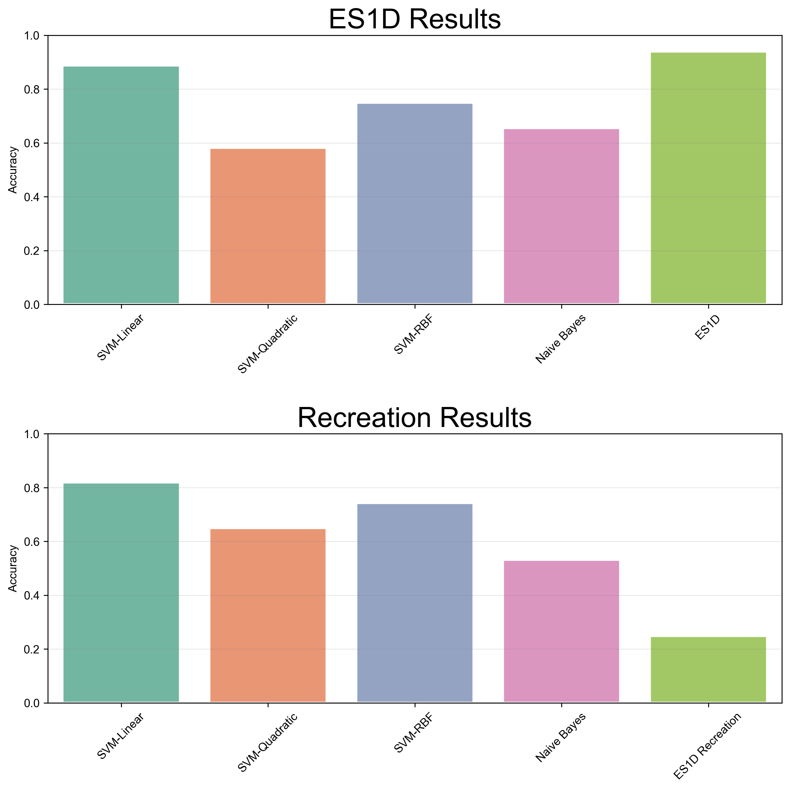

# ITCS 5156 Final Project: Deep Identification of Subject Age from EEG Data

## File Structure

- `recreation/` contains the code used to recreate the ES1D experiment
- `background_papers/` contains the background papers used to inform the project
- `paper/` contains my final paper and the latex source code for it

## Model Architecture

| ES1D Model | | Recreation|
| --- | --- | --- |
| Input 768x14 | | Input 1250x14 |
| 1D Conv-1 7x32 | | 1D Conv-1 7x32 |
| Maxpool/2 | | Maxpool/2 |
| 1D Conv-2 5x64 | | 1D Conv-2 5x64 |
| 1D Conv-3a 5x128 | | 1D Conv-3a 5x128 |
| 1D Conv-3b 10x128 | | 1D Conv-3b 10x128 |
| Inception Module | | Inception Module |
| 1D Conv-4a 3x256 | | 1D Conv-4a 3x256 |
| 1D Conv-4b 3x128 | | 1D Conv-4b 3x128 |
| 1D Conv-5a 3x64 | | 1D Conv-5a 3x64 |
| 1D Conv-5b 3x32 | | 1D Conv-5b 3x32 |
| Maxpool/2 | | Maxpool/2 |
| Flatten | | Flatten |
| Dense 1 (200 neurons) | | Dense 1 (200 neurons) |
| Dense 2 (200 neurons) | | Dense 2 (200 neurons) |
| Dense 3 (400 neurons) | | Dense 3 (400 neurons) |
| Output (23 neurons) | | Output (n neurons) |

## Parameters and Hyperparameters

| ES1D Model | | Recreation|
| --- | --- | --- |
| Batch Size: 150 | | Batch Size: 23 |
| Epochs: 1,000,000 | | Epochs: 150 |
| Learning Rate: 0.001 | | Learning Rate: 0.001 |
| Optimizer: Adam | | Optimizer: Adam |
| Loss Function: Categorical Crossentropy | | Loss Function: Categorical Crossentropy |

## Results

| ES1D Model | | Recreation|
| --- | --- | --- |
| Accuracy: 9401 | | Accuracy: 0.2493 |

The general results here were not ideal, as the figure below shows.

